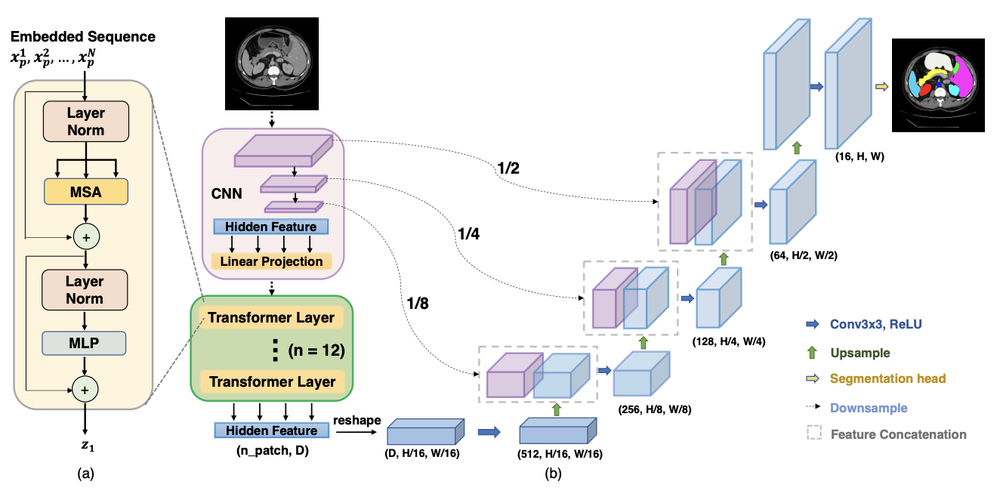

# ECG Segmentation

This repository contains the implementation of ECG signal segmentation using an adapted version of the TransUNet architecture for 1D data. The primary objective is to segment and classify heartbeats into five distinct classes using the MIT-BIH dataset. I implemented two lightweight backbones, MobileNet and EfficientNet, specifically tailored for 1D data. These models are designed to balance performance with the low latency and reduced complexity required in real-world applications.

### TransUNet

The TransUNet architecture, introduced by Chen et al. in 2021 ([Click for paper!](https://arxiv.org/pdf/2102.04306)), is an effective modification of the well-known U-Net model, integrating the strengths of transformers for enhanced feature extraction. Since the original TransUNet was designed for semantic segmentation of 2D images, I adapted it for 1D time series data. This required modifications to both the backbone and decoder architecture, ensuring all components were optimized for 1D input. As part of this adaptation, I implemented 1D versions of MobileNet and EfficientNet as backbones, which are efficient and well-suited for tasks where resource constraints are critical.

### Focal Loss

Instead of treating this problem purely as a segmentation task, I also drew from object detection methods by implementing Focal Loss, as proposed by Lin et al. in 2017 ([Click for paper!](https://arxiv.org/pdf/1708.02002v2)). Focal Loss is designed to address class imbalance, making it a perfect fit for this task, where certain heartbeat types occur far more frequently than others.

### Neural Architecutre Search (NAS)

To further optimize the model, I integrated a Neural Architecture Search (NAS) method, automating the process of selecting the best architecture for this dataset. I used SynFlow, a data-free scoring method that evaluates model importance without backpropagation or actual training. NAS optimized parameters such as the number of transformer layers, attention heads, encoder depth, and feature map sizes, ultimately finding the most effective architecture for ECG segmentation.

#### To-do List:
- Implement additional popular CNNs in 1D
- Explore other architectures for segmentation tasks
- Test on other medical time series data (e.g., EEG)
